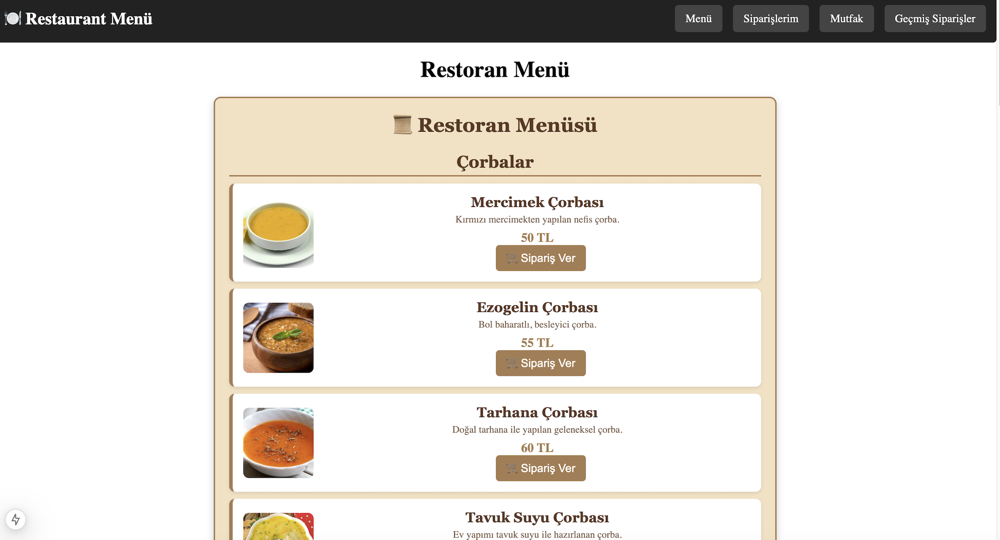

# 🍽️ Restoran Menü Sipariş Sistemi

Next.js ile geliştirilmiş modern ve dinamik bir **restoran menü sipariş uygulaması**.  
Bu proje sayesinde kullanıcılar menüden sipariş verebilir, siparişlerini onaylayarak mutfağa gönderebilir ve sipariş durumlarını takip edebilir.

 <!-- Buraya proje ekran görüntüsü ekleyebilirsin -->

---


---

## 🛠️ TEKNOLOJİLER & KÜTÜPHANELER
- **✅ Next.js** (React tabanlı framework)
- **✅ CSS Modules** (Component bazlı stillendirme)
- **✅ Context API** (Sipariş yönetimi için global state)
- **✅ JSON Data** (Menü verilerinin saklanması ve işlenmesi)
- **✅ Git & GitHub** (Versiyon kontrol ve proje paylaşımı)

---

## 📌 PROJEDE NELER YAPTIK?
### **1️⃣ Menü Sayfası (Ana Sayfa)**
📌 Kullanıcılar menüyü görebilir, yemekleri sepete ekleyebilir.  
📌 Yemekler kategori bazlı gösteriliyor.  
📌 "Sipariş Ver" butonuna basınca yemek **Siparişlerim** bölümüne ekleniyor.

### **2️⃣ Siparişlerim Sayfası**
📌 Kullanıcı eklediği siparişleri görebiliyor.  
📌 Toplam tutar hesaplanıyor ve gösteriliyor.  
📌 **"Siparişi Onayla"** butonuna basınca sipariş mutfağa gönderiliyor.  
📌 **"Sepeti Boşalt"** seçeneğiyle tüm siparişler temizlenebiliyor.  

### **3️⃣ Mutfak Sayfası**
📌 Kullanıcı tarafından onaylanan siparişler burada görünüyor.  
📌 **"Sipariş Hazır"** butonuyla sipariş tamamlanabiliyor.  
📌 Yeni sipariş geldiğinde **"Yeni Sipariş Var!"** bildirimi görünüyor.

### **4️⃣ Navbar (Menü Çubuğu)**
📌 Kullanıcı istediği sayfaya hızlıca ulaşabiliyor.  
📌 **Menü, Siparişlerim, Mutfak, Geçmiş Siparişler** gibi bölümler mevcut.  

### **5️⃣ Footer (Sayfa Alt Bilgisi)**
📌 Her sayfanın en altında dinamik olarak bulunuyor.  
📌 **İletişim bilgileri, sosyal medya ikonları ve restoran hakkında bilgiler** var.  
📌 Responsive tasarım sayesinde **mobil uyumlu**.  

---

## 📦 KURULUM & ÇALIŞTIRMA
🚀 **Projeyi kendi bilgisayarında çalıştırmak için aşağıdaki adımları izle.**  

1️⃣ **Projeyi klonla:**  
```bash
git clone https://github.com/kullaniciadi/restorant-menu.git
