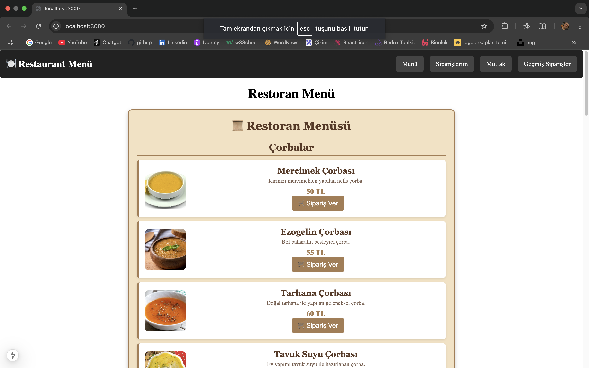

# 🍽️ Restoran Menü Sipariş Sistemi

Next.js ile geliştirilmiş modern ve dinamik bir **restoran menü sipariş uygulaması**.  
Bu proje sayesinde kullanıcılar menüden sipariş verebilir, siparişlerini onaylayarak mutfağa gönderebilir ve sipariş durumlarını takip edebilir.

 <!-- Buraya proje ekran görüntüsü ekleyebilirsin -->

---

## 🚀 Özellikler
✅ Dinamik restoran menüsü  
✅ **Sipariş ekleme, onaylama ve iptal etme**  
✅ **Mutfağa sipariş bildirim sistemi**  
✅ **Toplam tutar hesaplama**  
✅ **Modern ve şık kullanıcı arayüzü**  
✅ **Mobil uyumlu (Responsive)**  

---

## 🛠️ Kurulum ve Çalıştırma
1️⃣ **Projeyi klonla:**  
```bash
git clone https://github.com/kullaniciadi/restorant-menu.git
